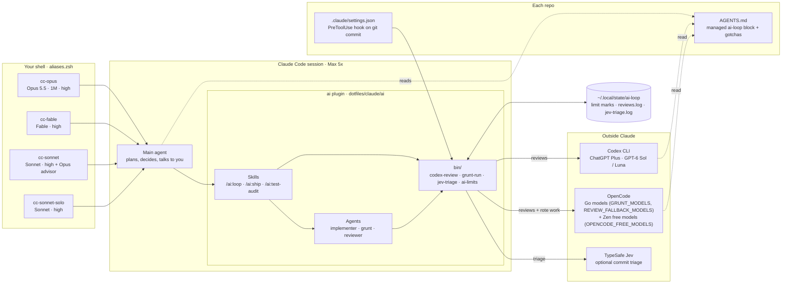
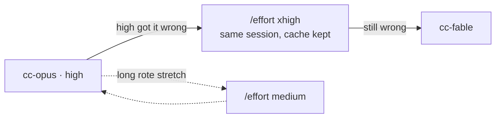
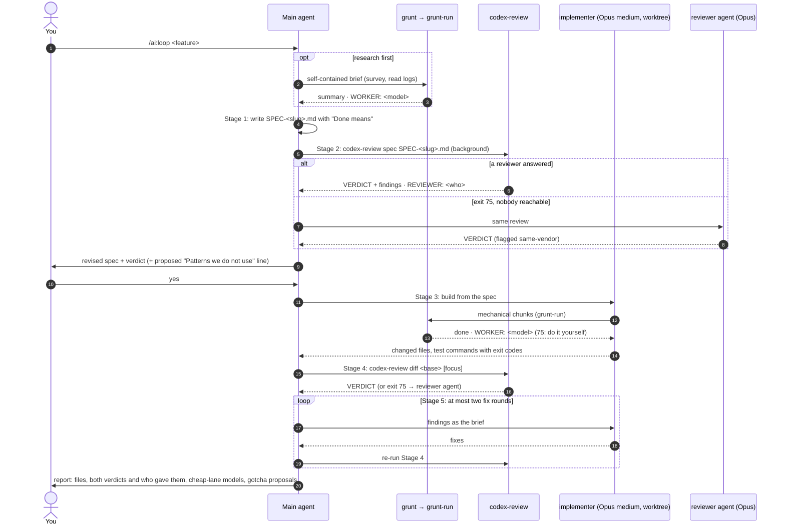
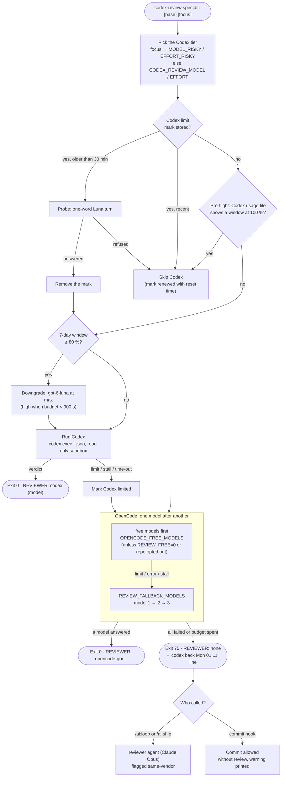
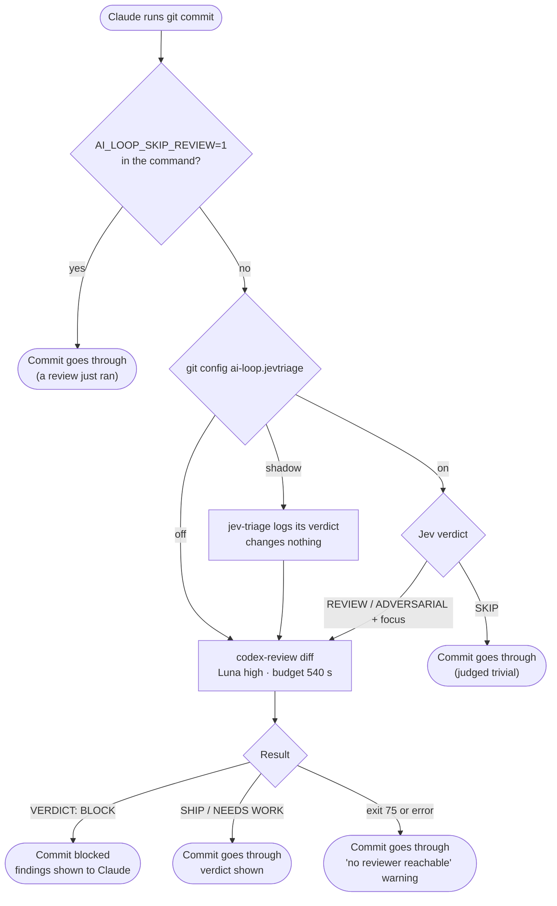
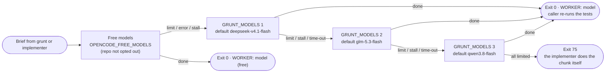
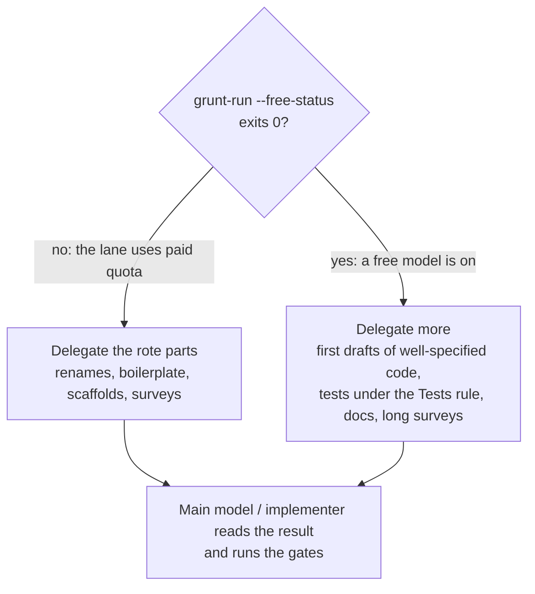
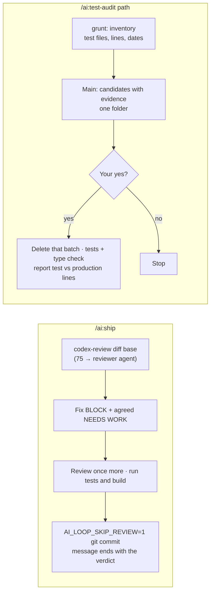
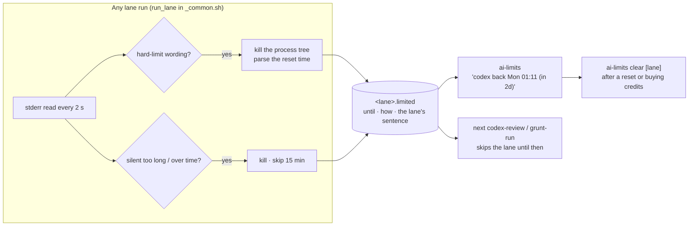

# How the `ai` setup works

A map of `dotfiles/claude`: what launches what, who reviews what, and where each fallback goes. The diagrams are Mermaid, so GitHub and VS Code's Markdown preview render them. The README explains why things are the way they are; this file shows how they fit together. As of plugin 0.6.0 (25 September 2026).

1. [The pieces](#1-the-pieces)
2. [Models and effort per launch alias](#2-models-and-effort-per-launch-alias)
3. [`/ai:loop`, one feature end to end](#3-ailoop-one-feature-end-to-end)
4. [`codex-review`: who reviews, and the fallback chain](#4-codex-review-who-reviews-and-the-fallback-chain)
5. [The pre-commit hook](#5-the-pre-commit-hook)
6. [`grunt-run`: the cheap lane](#6-grunt-run-the-cheap-lane)
7. [`/ai:ship` and `/ai:test-audit`](#7-aiship-and-aitest-audit)
8. [Limits and state](#8-limits-and-state)

---

## 1. The pieces

Everything outside Claude is reached through the scripts in `bin/`, never directly by an agent. That is what makes limits, time-outs and fallbacks work the same way from a skill, an agent or the commit hook.

---

## 2. Models and effort per launch alias

| Alias | Main session | Subagents | Effort at launch | Use it for |
|---|---|---|---|---|
| `cc-opus` | Opus 5.5, 1M context | per agent file (default Opus) | high | the daily driver |
| `cc-fable` | Fable | per agent file (default Opus 5.5) | high | what Opus at xhigh got wrong |
| `cc-sonnet` | Sonnet + Opus advisor | Sonnet (forced) | high | short sessions, cheaper |
| `cc-sonnet-solo` | Sonnet | Sonnet (forced) | high | comparing `/usage` |

`--effort` applies to that session only and wins over a level saved with `/effort`; `/effort` still changes it mid-session.

| Agent | Model in its file | Effort | Runs where |
|---|---|---|---|
| `implementer` | opus (Sonnet under cc-sonnet, which forces) | medium (pinned) | its own git worktree |
| `reviewer` | opus (Sonnet under cc-sonnet, which forces) | high (pinned) | read-only |
| `grunt` | haiku | none (Haiku has no effort setting) | relays to `grunt-run` |

---

## 3. `/ai:loop`, one feature end to end

The loop stops for you twice: after the spec review (step "yes") and on a second BLOCK in Stage 5. It never merges.

---

## 4. `codex-review`: who reviews, and the fallback chain

Every attempt, including the skipped ones, is a line in `reviews.log`: date, repo, mode, lane, model, verdict, outcome, seconds. Two Go models at their limit in one run mark the whole `opencode-go` provider, so the next call skips all of them. The whole call ends within `REVIEW_BUDGET` (1500 s; 540 s from the hook).

---

## 5. The pre-commit hook

The hook never falls back to Claude, so a commit never waits on a Claude review. It lives in each repo's `.claude/settings.json` and only fires on commits made through Claude Code.

---

## 6. `grunt-run`: the cheap lane

Override the order with `GRUNT_MODELS`; any OpenCode model id works. A free model that errors is skipped for 15 minutes (free periods end without notice). Each model gets `GRUNT_TIMEOUT` (2400 s) and `GRUNT_STALL_TIMEOUT` (600 s of silence). Secrets, env files, auth, payments, migrations and deploy config never go to this lane.

When a free model is on, the implementer, `/ai:loop`, the `grunt` agent and each repo's AGENTS.md shift work from Claude to that free model. That is where the Claude token savings come from. Most free models may train on what they are sent, so opt a repo out with `git config ai-loop.freelane off`.

---

## 7. `/ai:ship` and `/ai:test-audit`

Neither pushes or merges.

---

## 8. Limits and state

Files in `~/.local/state/ai-loop/`: `<lane>.limited`, `<lane>.stderr` (the last error in full), `codex.probed`, `cleared`, `reviews.log`, `jev-triage.log`. `ai-limits log` shows the last review calls; `ai-limits triage` compares Jev with the reviews.
